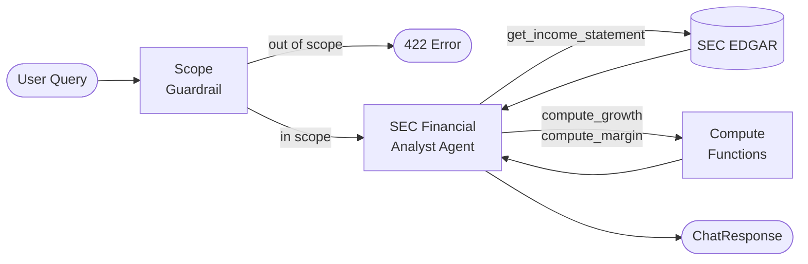

# Sec.io

An AI-powered financial analyst that answers natural language questions about public companies using SEC EDGAR filings. Ask *"What was Apple's revenue growth from FY2023 to FY2024?"* and get a structured, cited answer grounded entirely in 10-K and 10-Q data — no hallucinated numbers.

---

## How it works

A single agent with tools converts a raw user message into a cited answer:



| Stage | What happens |
|---|---|
| **Scope guardrail** | Checks the message before it reaches the LLM. Rejects queries about balance sheets, stock prices, dividends, etc. with a `422`. |
| **Agent** | A single OpenAI Agents SDK agent decides which tools to call and in what order, then narrates the results in plain English. |
| **Data tools** | `get_income_statement` fetches 10-K or 10-Q income statement data from SEC EDGAR (async, TTL-cached). |
| **Compute tools** | `compute_growth` and `compute_margin` perform deterministic arithmetic so the LLM never does math itself. |

---

## Core capabilities

- **Income statement retrieval** — revenue, net income, EPS, gross profit, and operating income from 10-K and 10-Q filings
- **Growth computation** — year-over-year and quarter-over-quarter growth rates with explicit formulas
- **Margin computation** — gross, operating, and net margin percentages
- **Multi-turn conversations** — conversation history is forwarded to the agent so context carries across turns
- **Scope enforcement** — queries about balance sheets, cash flows, stock prices, dividends, etc. are rejected before hitting the LLM
- **Input sanitization** — control characters stripped, length capped at 2000 characters
- **TTL cache** — EDGAR responses are cached in-process for 15 minutes to avoid redundant network calls

---

## Project structure

```
sec-llm/
├── src/sec_llm/
│   ├── main.py            # FastAPI app factory, CORS middleware, lifespan hooks
│   ├── config.py          # Settings via pydantic-settings (SEC_LLM_ prefix)
│   ├── dependencies.py    # @lru_cache DI factories for agent, clients, settings
│   ├── models.py          # Pydantic schemas: errors, financials
│   ├── compute.py         # Growth and margin computation functions
│   ├── agent.py           # sec_agent definition: tools + scope guardrail
│   ├── runner.py          # run_conversation() — OpenAI Agents SDK runner wrapper
│   ├── guardrails.py      # check_scope, sanitize_input
│   ├── prompts/
│   │   └── agent_system.txt
│   ├── api/
│   │   ├── chat.py        # POST /api/chat
│   │   ├── company.py     # GET /api/company/{ticker}
│   │   ├── health.py      # GET /api/health
│   │   └── router.py      # Aggregates all routers
│   └── sec/
│       ├── client.py      # EdgarClient — async wrapper over edgartools
│       ├── extractor.py   # Parse IncomeStatementData from filing objects
│       ├── normalizer.py  # DataFrame label matching + LABEL_CANDIDATES map
│       └── cache.py       # TTLCache (in-process, monotonic clock)
└── tests/
    ├── unit/              # Pure function tests (compute, normalizer)
    └── integration/       # API and SEC client tests
```

---

## API reference

| Method | Path | Description |
|---|---|---|
| `GET` | `/api/health` | Liveness check — returns `{"status": "ok"}` |
| `GET` | `/api/company/{ticker}` | Company metadata from EDGAR (name, CIK, SIC, exchange) |
| `POST` | `/api/chat` | Main query endpoint — accepts `ChatRequest`, returns `ChatResponse` |

### POST /api/chat

**Request**
```json
{
  "message": "What was Apple's revenue growth from FY2023 to FY2024?",
  "conversation_history": []
}
```

**Response**
```json
{
  "answer": "Apple's revenue grew 2.02% from FY2023 ($383.3B) to FY2024 ($391.0B).",
  "citations": [
    {
      "ticker": "AAPL",
      "filing_type": "10-K",
      "fiscal_period": "FY2023",
      "filing_date": "2023-11-03"
    },
    {
      "ticker": "AAPL",
      "filing_type": "10-K",
      "fiscal_period": "FY2024",
      "filing_date": "2024-11-01"
    }
  ]
}
```

**Error codes**

| Status | Cause |
|---|---|
| `422` | Out-of-scope query (balance sheet, stock price, etc.) or invalid input |
| `404` | Ticker or filing not found in EDGAR |
| `429` | Rate limit exceeded (20 requests/minute per IP) |

---

## Setup

### Prerequisites

- Python 3.10+
- [uv](https://docs.astral.sh/uv/) — install it with:
  ```bash
  curl -LsSf https://astral.sh/uv/install.sh | sh
  ```
- An OpenAI API key — get one at [platform.openai.com/api-keys](https://platform.openai.com/api-keys)
- An EDGAR identity string (your real name + email), required by the [SEC fair-use policy](https://www.sec.gov/developer)

### 1. Clone and install

```bash
git clone https://github.com/your-org/sec-llm.git
cd sec-llm
uv sync --extra dev
```

`uv sync` creates a `.venv` inside the project and installs all dependencies from `uv.lock`. The `--extra dev` flag adds pytest, ruff, and related tooling.

### 2. Configure environment

Copy the example env file and fill in your values:

```bash
cp .env.example .env
```

Open `.env` and set the following variables:

```bash
SEC_LLM_OPENAI_API_KEY="<OPENAI_API_KEY>"
SEC_LLM_EDGAR_IDENTITY="<Your Name your@email.com>"  # required by SEC policy
```

You can leave other environment variables as it is.

### 3. Run

```bash
uv run uvicorn sec_llm.main:app --reload
```

The API is now available at `http://localhost:8000`. Interactive docs (Swagger UI) at `http://localhost:8000/docs`.

### 4. Verify

```bash
# Health check
curl http://localhost:8000/api/health
# → {"status":"ok"}

# Send a query
curl -X POST http://localhost:8000/api/chat \
  -H "Content-Type: application/json" \
  -d '{"message": "What was Apple revenue in FY2024?"}'

# Confirm scope enforcement works
curl -X POST http://localhost:8000/api/chat \
  -H "Content-Type: application/json" \
  -d '{"message": "Show me Apple balance sheet"}'
# → 422 with out-of-scope detail message
```

---

## Testing

```bash
# Unit + integration tests (no external calls, fast)
uv run pytest tests/unit/ tests/integration/test_api.py -v

# Full suite including live EDGAR calls
uv run pytest -v

# Only the live EDGAR tests
uv run pytest -m slow -v
```

---

## Supported metrics

| Key | Description | Filing source |
|---|---|---|
| `revenue` | Total net revenue / net sales | 10-K, 10-Q |
| `net_income` | Net income (loss) | 10-K, 10-Q |
| `eps` | Diluted earnings per share | 10-K, 10-Q |
| `gross_margin` | Gross profit raw value | 10-K, 10-Q |
| `operating_income` | Operating income (loss) | 10-K, 10-Q |

Only income statement data is supported. Balance sheet, cash flow, segment, and geographic data are explicitly out of scope.

---

## Limitations

- **Income statement only.** Balance sheet, cash flow, segment, and geographic breakdowns are not supported.
- **EDGAR data quality varies.** XBRL label naming is inconsistent across companies and filing years. The normalizer uses fuzzy label matching with a priority-ordered candidate list, which may miss unusual labels.
- **Fiscal year heuristics.** Filing-to-fiscal-year matching uses `period_of_report` dates and filing date ranges. Companies with non-calendar fiscal years may occasionally match the wrong filing.
- **In-process cache only.** The TTL cache is per-process and not shared across workers. For multi-worker deployments, replace `TTLCache` with a shared store (Redis, Memcached, etc.).
