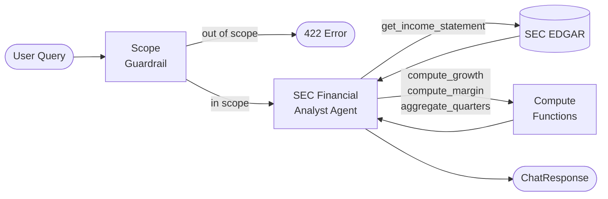
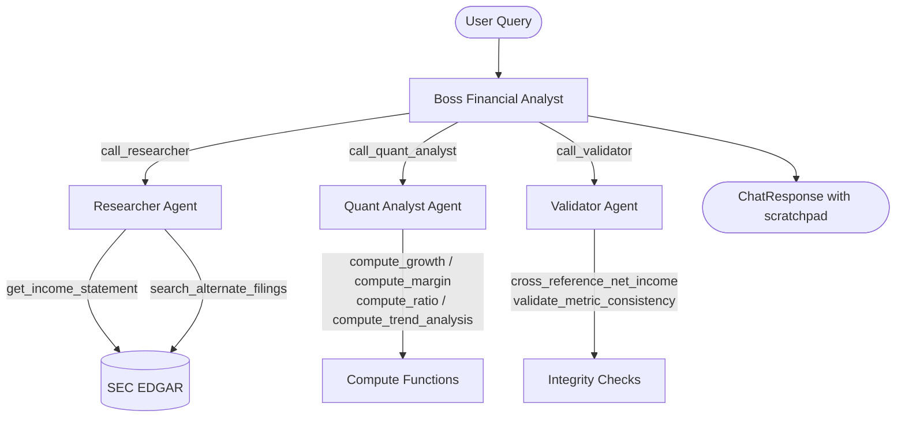

# Sec.io

An AI-powered financial analyst that answers natural language questions about public companies using SEC EDGAR filings. Ask *"What was Apple's revenue growth from FY2023 to FY2024?"* and get a structured, cited answer grounded entirely in 10-K and 10-Q data — no hallucinated numbers.

Two modes are available via the `?mode=` query parameter:

| Mode | Description |
|---|---|
| `single` (default) | A single agent handles the entire query end-to-end |
| `multi` | A Boss-Worker team of four specialized agents collaborates: Boss orchestrates, Researcher fetches data, Quant Analyst computes, Validator cross-checks |

---

## How it works

### Single-agent mode (default)

A single agent with tools converts a raw user message into a cited answer:


```mermaid
flowchart LR
    A([User Query]) --> B[Scope<br/>Guardrail]
    B -->|out of scope| C([422 Error])
    B -->|in scope| D[SEC Financial<br/>Analyst Agent]
    D -->|get_income_statement| E[(SEC EDGAR)]
    E --> D
    D -->|compute_growth<br/>compute_margin<br/>aggregate_quarters| F[Compute<br/>Functions]
    F --> D
    D --> G([ChatResponse])
```

| Stage | What happens |
|---|---|
| **Scope guardrail** | Checks the message before it reaches the LLM. Rejects queries about balance sheets, stock prices, dividends, etc. with a `422`. |
| **Agent** | A single OpenAI Agents SDK agent decides which tools to call and in what order, then narrates the results in plain English. |
| **Data tools** | `get_income_statement` fetches 10-K or 10-Q income statement data from SEC EDGAR (async, TTL-cached). |
| **Compute tools** | `compute_growth`, `compute_margin`, and `aggregate_quarters` perform deterministic arithmetic so the LLM never does math itself. |

### Multi-agent mode (`?mode=multi`)

A Boss agent orchestrates three specialized worker agents using the **agents-as-tools** pattern from the OpenAI Agents SDK:


```mermaid
flowchart TD
    A([User Query]) --> B[Boss Financial Analyst]
    B -->|call_researcher| C[Researcher Agent]
    B -->|call_quant_analyst| D[Quant Analyst Agent]
    B -->|call_validator| E[Validator Agent]
    C -->|get_income_statement| F[(SEC EDGAR)]
    C -->|search_alternate_filings| F
    D -->|compute_growth / compute_margin<br/>compute_ratio / compute_trend_analysis| G[Compute Functions]
    E -->|cross_reference_net_income<br/>validate_metric_consistency| H[Integrity Checks]
    B --> I([ChatResponse with scratchpad])
```

| Agent | Role | Tools |
|---|---|---|
| **Boss** | Orchestrates the plan, deposits results into a Scratchpad, synthesizes the final answer | `call_researcher`, `call_quant_analyst`, `call_validator` |
| **Researcher** | Fetches raw SEC EDGAR data — never computes | `get_income_statement`, `search_alternate_filings` |
| **Quant Analyst** | Performs all calculations — never fetches data | `compute_growth`, `compute_margin`, `aggregate_quarters`, `compute_ratio`, `compute_trend_analysis` |
| **Validator** | Cross-checks metric consistency — flags discrepancies > 1% | `cross_reference_net_income`, `validate_metric_consistency` |

The Boss maintains a **Scratchpad** (a structured JSON object) in its message context that tracks:
- `goal` — restatement of the user's question
- `tasks` — plan with task IDs, assigned agents, statuses, and dependencies
- `knowledge_base` — results deposited by each worker
- `revision_history` — log of error recovery actions (e.g. alternate filing search)

**Automatic error recovery:**
- If `get_income_statement` returns not-found, the Boss triggers a `search_alternate_filings` call and logs a revision entry
- If the Validator flags a discrepancy > 1%, the Boss adds a deep-dive task and reports the inconsistency transparently

---

## Core capabilities

- **Income statement retrieval** — revenue, net income, EPS, gross profit, and operating income from 10-K and 10-Q filings
- **Growth computation** — year-over-year and quarter-over-quarter growth rates with explicit formulas
- **Margin computation** — gross, operating, and net margin percentages
- **Ratio computation** — R&D intensity, SG&A ratio, and any custom numerator/denominator ratio
- **Trend analysis** — period-over-period growth rates, CAGR, min/max/avg across 3+ years
- **Quarter aggregation** — sum or average a metric across multiple quarters (e.g. trailing-twelve-months revenue)
- **Data validation** — cross-reference net income and metric consistency across sources
- **Alternate filing search** — fallback to 10-K/A, 20-F, and other form types when primary filing is missing
- **Multi-turn conversations** — conversation history is forwarded to the agent so context carries across turns
- **Scope enforcement** — queries about balance sheets, cash flows, stock prices, dividends, etc. are rejected before hitting the LLM
- **Input sanitization** — control characters stripped, length capped at 2000 characters
- **TTL cache** — EDGAR responses are cached in-process for 15 minutes to avoid redundant network calls

---

## Project structure

```
sec-llm/
├── src/sec_llm/
│   ├── main.py            # FastAPI app factory, CORS middleware, lifespan hooks
│   ├── config.py          # Settings via pydantic-settings (SEC_LLM_ prefix)
│   ├── dependencies.py    # @lru_cache DI factories for agent, clients, settings
│   ├── models.py          # Pydantic schemas: errors, financials
│   ├── compute.py         # Growth and margin computation functions
│   ├── agent.py           # sec_agent definition: tools + input guardrail
│   ├── runner.py          # run_conversation() and run_multi_agent_conversation()
│   ├── guardrails.py      # check_scope, sanitize_input
│   ├── agents/            # Multi-agent system (Boss-Worker)
│   │   ├── boss.py        # Boss orchestrator agent
│   │   ├── researcher.py  # Researcher agent
│   │   ├── quant.py       # Quant Analyst agent
│   │   ├── validator.py   # Validator agent
│   │   ├── scratchpad.py  # Pydantic state models (Scratchpad, ScratchpadTask, …)
│   │   └── tools/
│   │       ├── researcher_tools.py  # search_alternate_filings
│   │       ├── quant_tools.py       # compute_ratio, compute_trend_analysis
│   │       └── validator_tools.py   # cross_reference_net_income, validate_metric_consistency
│   ├── prompts/
│   │   ├── agent_system.txt      # Single-agent system prompt
│   │   ├── boss_system.txt       # Boss orchestrator instructions
│   │   ├── researcher_system.txt # Researcher agent instructions
│   │   ├── quant_system.txt      # Quant Analyst instructions
│   │   └── validator_system.txt  # Validator instructions
│   ├── api/
│   │   ├── chat.py        # POST /api/chat (supports ?mode=single|multi)
│   │   ├── company.py     # GET /api/company/{ticker}
│   │   ├── health.py      # GET /api/health
│   │   └── router.py      # Aggregates all routers
│   └── sec/
│       ├── client.py      # EdgarClient — async wrapper over edgartools
│       ├── extractor.py   # Parse IncomeStatementData from filing objects
│       ├── normalizer.py  # DataFrame label matching + LABEL_CANDIDATES map
│       └── cache.py       # TTLCache (in-process, monotonic clock)
└── tests/
    ├── unit/              # Pure function tests (compute, normalizer)
    ├── integration/       # API and SEC client tests
    ├── run_conversations.py              # Single-agent fixture runner
    └── run_multi_agent_conversations.py  # Multi-agent fixture runner
```

---

## API reference

| Method | Path | Description |
|---|---|---|
| `GET` | `/api/health` | Liveness check — returns `{"status": "ok"}` |
| `GET` | `/api/company/{ticker}` | Company metadata from EDGAR (name, CIK, SIC, exchange) |
| `POST` | `/api/chat` | Main query endpoint — accepts `ChatRequest`, returns `ChatResponse` |

### POST /api/chat

Accepts an optional `?mode=` query parameter:
- `?mode=single` (default) — uses the single SEC Financial Analyst agent
- `?mode=multi` — uses the Boss-Worker multi-agent system; response includes a populated `scratchpad`

**Request**
```json
{
  "message": "What was Apple's revenue growth from FY2023 to FY2024?",
  "conversation_history": []
}
```

**Single-agent response** (`?mode=single` or no param)
```json
{
  "answer": "Apple's revenue grew 2.02% from FY2023 ($383.3B) to FY2024 ($391.0B).",
  "citations": [
    {
      "ticker": "AAPL",
      "filing_type": "10-K",
      "fiscal_period": "FY2023",
      "filing_date": "2023-11-03"
    },
    {
      "ticker": "AAPL",
      "filing_type": "10-K",
      "fiscal_period": "FY2024",
      "filing_date": "2024-11-01"
    }
  ],
  "scratchpad": {}
}
```

**Multi-agent response** (`?mode=multi`)
```json
{
  "answer": "Apple's revenue grew 2.02% from FY2023 ($383.3B) to FY2024 ($391.0B)...",
  "citations": [...],
  "scratchpad": {
    "goal": "Compute Apple revenue growth from FY2023 to FY2024",
    "tasks": [
      {"task_id": "T1", "assigned_to": "RESEARCHER", "status": "COMPLETED", "description": "Fetch AAPL FY2023 income statement"},
      {"task_id": "T2", "assigned_to": "RESEARCHER", "status": "COMPLETED", "description": "Fetch AAPL FY2024 income statement"},
      {"task_id": "T3", "assigned_to": "QUANT",      "status": "COMPLETED", "description": "Compute YoY revenue growth"}
    ],
    "knowledge_base": {"aapl_fy2023": {}, "aapl_fy2024": {}, "revenue_growth": {}},
    "revision_history": [],
    "final_answer": "Apple revenue grew 2.02% YoY to $391.0B in FY2024."
  }
}
```

**Error codes**

| Status | Cause |
|---|---|
| `422` | Out-of-scope query (balance sheet, stock price, etc.) or invalid input |
| `404` | Ticker or filing not found in EDGAR |
| `429` | Rate limit exceeded (20 requests/minute per IP) |

---

## Setup

### Prerequisites

- Python 3.10+
- [uv](https://docs.astral.sh/uv/) — install it with:
  ```bash
  curl -LsSf https://astral.sh/uv/install.sh | sh
  ```
- An OpenAI API key — get one at [platform.openai.com/api-keys](https://platform.openai.com/api-keys)
- An EDGAR identity string (your real name + email), required by the [SEC fair-use policy](https://www.sec.gov/developer)

### 1. Clone and install

```bash
git clone https://github.com/your-org/sec-llm.git
cd sec-llm
uv sync --extra dev
```

`uv sync` creates a `.venv` inside the project and installs all dependencies from `uv.lock`. The `--extra dev` flag adds pytest, ruff, and related tooling.

### 2. Configure environment

Copy the example env file and fill in your values:

```bash
cp .env.example .env
```

Open `.env` and set the following variables:

```bash
SEC_LLM_OPENAI_API_KEY="<OPENAI_API_KEY>"
SEC_LLM_EDGAR_IDENTITY="<Your Name your@email.com>"  # required by SEC policy
```

Optional variables (defaults shown):

```bash
SEC_LLM_AGENT_MODEL="gpt-4o"   # model for single-agent and all worker agents
SEC_LLM_BOSS_MODEL="gpt-4o"    # model for the Boss orchestrator (set to "o1" for heavier reasoning)
```

### 3. Run

```bash
uv run uvicorn sec_llm.main:app --reload
```

The API is now available at `http://localhost:8000`. Interactive docs (Swagger UI) at `http://localhost:8000/docs`.

### 4. Verify

```bash
# Health check
curl http://localhost:8000/api/health
# → {"status":"ok"}

# Single-agent query (default)
curl -X POST http://localhost:8000/api/chat \
  -H "Content-Type: application/json" \
  -d '{"message": "What was Apple revenue in FY2024?"}'

# Multi-agent query — includes scratchpad in response
curl -X POST "http://localhost:8000/api/chat?mode=multi" \
  -H "Content-Type: application/json" \
  -d '{"message": "What was Apple revenue and net margin for FY2024?"}'

# Confirm scope enforcement works
curl -X POST http://localhost:8000/api/chat \
  -H "Content-Type: application/json" \
  -d '{"message": "Show me Apple balance sheet"}'
# → 422 with out-of-scope detail message
```

---

## Testing

```bash
# Unit + integration tests (no external calls, fast)
uv run pytest tests/unit/ tests/integration/test_api.py -v

# Full suite including live EDGAR calls
uv run pytest -v

# Only the live EDGAR tests
uv run pytest -m slow -v

# Single-agent end-to-end fixture runner (requires OPENAI_API_KEY + EDGAR_IDENTITY)
uv run python tests/run_conversations.py

# Multi-agent end-to-end fixture runner — runs all 5 Boss-Worker scenarios
uv run python tests/run_multi_agent_conversations.py

# Run specific multi-agent scenarios
uv run python tests/run_multi_agent_conversations.py --ids ma_conv_01 ma_conv_03

# Multi-agent runner with console span tracing
uv run python tests/run_multi_agent_conversations.py --console-trace
```

The multi-agent fixture scenarios cover:

| ID | Scenario |
|---|---|
| `ma_conv_01` | Single company revenue + net margin (Researcher → Quant) |
| `ma_conv_02` | Multi-year trend analysis with CAGR (Researcher × 3 → Quant trend) |
| `ma_conv_03` | Peer operating margin comparison (Researcher × 2 → Quant ratio) |
| `ma_conv_04` | Data integrity validation (Researcher → Validator cross-reference) |
| `ma_conv_05` | Error recovery — alternate filing search when primary not found |

---

## Supported metrics

| Key | Description | Filing source |
|---|---|---|
| `revenue` | Total net revenue / net sales | 10-K, 10-Q |
| `net_income` | Net income (loss) | 10-K, 10-Q |
| `eps` | Diluted earnings per share | 10-K, 10-Q |
| `gross_profit` | Gross profit (revenue minus cost of revenue) | 10-K, 10-Q |
| `operating_income` | Operating income (loss) | 10-K, 10-Q |

Only income statement data is supported. Balance sheet, cash flow, segment, and geographic data are explicitly out of scope.

---

## Limitations

- **Income statement only.** Balance sheet, cash flow, segment, and geographic breakdowns are not supported by either mode.
- **EDGAR data quality varies.** XBRL label naming is inconsistent across companies and filing years. The normalizer uses fuzzy label matching with a priority-ordered candidate list, which may miss unusual labels.
- **Fiscal year heuristics.** Filing-to-fiscal-year matching uses `period_of_report` dates and filing date ranges. Companies with non-calendar fiscal years may occasionally match the wrong filing.
- **In-process cache only.** The TTL cache is per-process and not shared across workers. For multi-worker deployments, replace `TTLCache` with a shared store (Redis, Memcached, etc.).
- **Multi-agent scratchpad is best-effort.** The `scratchpad` field is parsed from a JSON code block in the Boss agent's final output. If the model omits or malforms the block, `scratchpad` returns as `{}`.
- **Multi-agent latency.** The Boss-Worker mode makes multiple sequential LLM calls and may be 3–5× slower than single-agent mode for simple queries. Use `?mode=single` when latency matters more than auditability.
